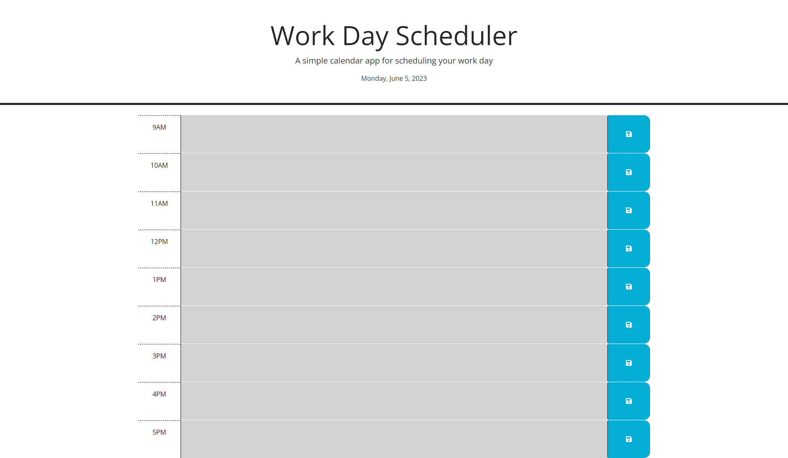
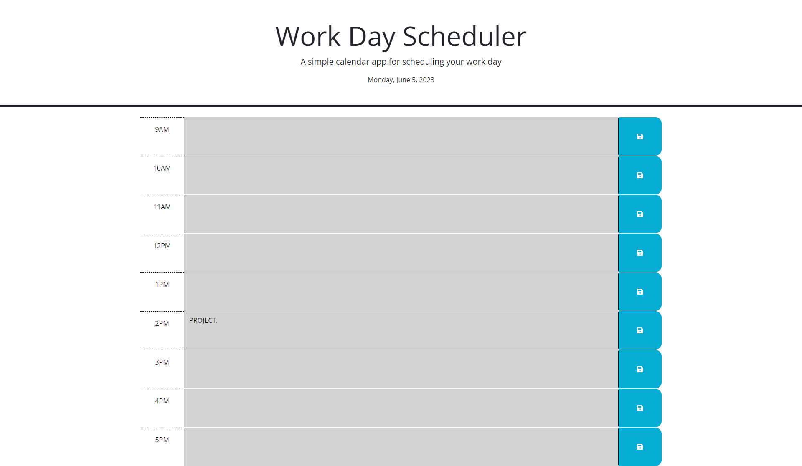

# C5-TheWDScheduler
## Main Task

This Challenge invites you to create a simple calendar application that allows a user to save events for each hour of the day by modifying starter code. This app will run in the browser and feature dynamically updated HTML and CSS powered by jQuery.

You'll need to use the [Day.js](https://day.js.org/en/) library to work with date and time. Be sure to read the documentation carefully and concentrate on using Day.js in the browser.

## Requirements:

## User Story

```
AS AN employee with a busy schedule
I WANT to add important events to a daily planner
SO THAT I can manage my time effectively
```
## Acceptance Criteria

```
GIVEN I am using a daily planner to create a schedule
WHEN I open the planner
THEN the current day is displayed at the top of the calendar
WHEN I scroll down
THEN I am presented with timeblocks for standard business hours
WHEN I view the timeblocks for that day
THEN each timeblock is color coded to indicate whether it is in the past, present, or future
WHEN I click into a timeblock
THEN I can enter an event
WHEN I click the save button for that timeblock
THEN the text for that event is saved in local storage
WHEN I refresh the page
THEN the saved events persist
```
> **(Main Task, User Story and Acceptance Criteria / Challenge 5; CARL-VIRT-FSF-PT-04-2023, README.md 2023)** 

## Final Work Review

**"Always leave the code a little cleaner than when you found it."**  This action was applied to HTML, CSS and JAVASCRIPT. To create an online Quiz from scratch, I used Jon Ducket's JAVASCRIPT & JQuery book, Google, W3Schools, CSSPortal, Snyk and all ZOOM recordings (of previous classes). Looks much cleaner, organised and easier to find what you are looking for. Comments were added in JAVASCRIPT to show what was done and for what purpose.

> **(CARL-VIRT-FSF-PT-04-2023, Challenge 5 / README.md 2023)**
> **(JAVASCRIPT & JQUERRY, Jon Duckett, Wiley; First edition (June 30 2014) pages 14-292. )**

The following animation demonstrates the application functionality:

> **(I was not able to solve the issue in the code for displaying the correct colors.)**

### How the Web Scheduler looks:



### How the Web Scheduler looks: When you enter data in a time block.



### How the Web Scheduler looks: When you remove the data entered.


The assignment can be viewed here: [C5-TheWDScheduler](https://smarquis85.github.io/C5-TheWDScheduler/)
